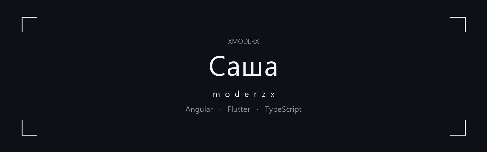
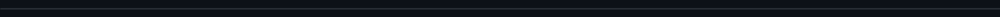
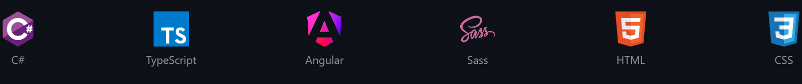

### > Привет, я **Саша**

「 Full stack. Делаю моды для игр на C#. В Steam — moderzx. 」

[Steam](https://steamcommunity.com/profiles/76561199519603890/) · [VK](https://vk.ru/moderzx) · [Telegram](https://t.me/moderzx) · [Discord](https://discord.com/users/472467602091016192) · [почта](mailto:moderzx01@gmail.com)

Discord id `472467602091016192`, ник moderzx.



## Стек




```text
                    .--------.
                 .-'          `-.
               .'    .------.    `.
              /     |   mx   |     \
             |       `------'       |
             |     full stack       |
              \      mods · C#     /
               `.                .'
                 `-.          .-'
                    `--------'
                         |
                    .----'----.
                   /  moderzx  \
                   `-----------'
```


## Профиль

```javascript
const XMODERX = {
    aka: "moderzx",
    age: 20,
    role: "Full stack",
    mods: ["C#"],
    stack: {
        daily: ["C#", "TypeScript", "Angular"],
        also: ["Sass", "HTML", "CSS"]
    },
/*
C#
        :--:
     :-++++++-:
  :-+=:.    .-++-:
 :++-   .::.   =+*:
 :+=  .=++++=:+++=:
 :+=  -++=+***+ .::
 :++  .=*****+*==*:
 :+==   ---:  .***:
  :+**=.:  .:=**+:
     :+******=:
        :==:

TypeScript
=++++++++++++++++++=
=++++++++++++++++++=
=++++++++++++++++++=
=++++++++++++++++++=
=++++++++++++++++++=
=+++:      -=.  .=+=
=++++++  +++: :+=++=
=++++++  ++++-  .=+=
=++++++  +++=-+=. +=
=++++++  +++:   .-+=
-==================-

Angular
    .-=:    :=-.
.-====-      -+++=-.
-=====        =+++*:
:====    ::    =+**.
.===    .=+.    +**
 ==.    =++=    .**
 =:    .----.    .+
 :                .
     .++++++**.
     -++++++++:
       .-=+-.

Sass
      ..::.
   .::.....-.
 :-.       -.
:-   ....::
.-.   ..:  : .-
  .:..-::.::: -:.:.
  ..:.-.--.--::.   .
 -  - ...  .
 .:.

HTML
 .----------------.
 .================.
 .==-          :==.
  ===  --------===
  ===  ::::::::===
  -==:......   ==-
  :==:.-====: .==:
  .==: .::..  :==.
  .===-::...::-==.
   -============-
      ..:--:..

CSS
 -++++++++++++++++-
 :++++++++=======+:
 .++=          :=+.
  +++=====---  -=+
  +++++=--::.  ==+
  =++++=--::...=+=
  -++-.-++==: .=+-
  :++- .::..  :=+:
  .+++==-:.::-==+.
   =++++++====++=
     .:-=++=-:.
*/
    links: {
        steam: "https://steamcommunity.com/profiles/76561199519603890/",
        vk: "https://vk.ru/moderzx",
        telegram: "https://t.me/moderzx",
        discord: "https://discord.com/users/472467602091016192",
        email: "moderzx01@gmail.com"
    }
};
```


## Статистика

[](https://github.com/XMODERX)


## Контакты

[Steam](https://steamcommunity.com/profiles/76561199519603890/) · [VK](https://vk.ru/moderzx) · [Telegram](https://t.me/moderzx) · [Discord](https://discord.com/users/472467602091016192) · [почта](mailto:moderzx01@gmail.com)
